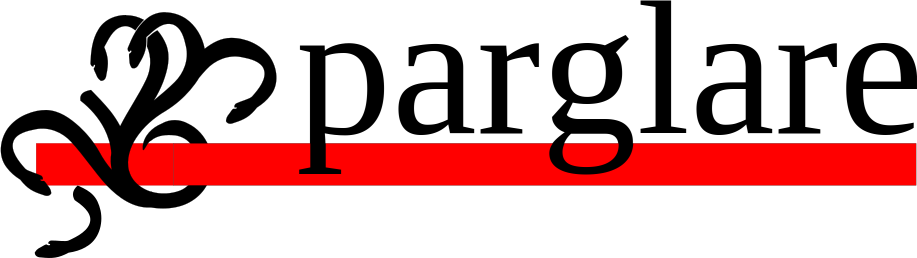

---

A pure Python LR/GLR parser.

## Feature highlights

* **Integrated scanner**

    There is no lexing as a separate phase. There is no separate lexer grammar.
    The parser will try to reconize token during parsing at the given location.
    This brings more parsing power as there are no lexical ambiguities
    introduced by a separate lexing stage. You want variables in your language
    to be named like some of the keywords? No problem.

* **Generalized parsing - GLR**

    parglare gives you powerful tools to see where non-determinism in your
    grammar lies (the notorious [shift-reduce and reduce-reduce
    conflicts](./lr_parsing.md)) and gives detailed info on why that happened.
    In case your language needs non-deterministic parsing — either it needs
    additional lookahead to decide or your language is inherently ambiguous —
    you can resort to the GLR algorithm by a simple change of the parser class.
    The grammar stays the same.

    In the case of non-determinism (unability for a parser to deterministically
    decide what to do) the parser will fork and investigate each possibility.
    Eventualy, parsers that decided wrong will die leaving only the right one.
    In case there are multiple interpretation of your input you will get all the
    trees (a.k.a. "the parse forest").

* [**Declarative associativity and priority rules**](./disambiguation.md)

    These problems arise a lot when building expression languages. Even an
    arithmetic expression as small as `3 + 4 * 5 * 2` have multiple
    interpretation depending on the associativity and priority of operations. In
    parglare it is easy to specify these rules in the grammar (see the quick
    intro below or [the calc
    example](https://github.com/igordejanovic/parglare/blob/master/examples/calc/calc.py)).

* [**Tracing/debugging, visualization and error reporting**](./debugging.md)

    There is an extensive support for grammar checking, debugging, automata
    visualization, and parse tracing. Check out [pglr command](./pglr.md).

* **Parsing an arbitrary list of objects**

    parglare is not used only to parse a textual content. It can parse (create a
    tree) of an arbitrary list of objects (numbers, bytes, whatever) based on a
    common parglare grammar. For this you have to define [token
    recognizers](./recognizers.md) for your input stream. The built-in
    recognizers are string and regex recognizers for parsing textual inputs. See
    `recognizers` parameter to grammar construction in the [test_recognizers.py
    test](https://github.com/igordejanovic/parglare/blob/master/tests/func/recognizers/test_recognizers.py).

* [**Flexible actions calling strategies**](./actions.md)

    During parsing you will want to do something when the grammar rule matches.
    The whole point of parsing is that you want to transform your input to some
    output. There are several options:

    - by default parser builds nested lists;
    - you can build a tree using `build_tree=True` parameter to the parser;
    - call user-supplied actions - you write a Python function that is called
      when the rule matches. You can do whatever you want at this place and the
      result returned is used in parent rules/actions. There are some handy
      build-in actions in the [`parglare.actions`
      module](./actions.md#built-in-actions).
    - User actions may be postponed and called on the parse tree - this is handy
      if you want to process your tree in multiple ways, or you are using GLR
      parsing and the actions are introducing side-effects and you would like to
      avoid those effects created from wrong parsers/trees.

* [**Grammar modularization**](./grammar_modularization.md)

    Grammars can be split in multiple files and imported where needed. In
    addition each grammar file may have an
    [actions](./grammar_modularization.md#grammar-file-actions) and
    [recognizers](./grammar_modularization.md#grammar-file-recognizers) python
    file defined. This enable a nice separation of parts of the language with
    their grammars and accompanying actions and recognizers.

* [**Support for whitespaces/comments**](./grammar_language.md#handling-whitespaces-and-comments-in-your-language)

    Support for language comments/whitespaces is done using the special rule
    `LAYOUT`. By default whitespaces are skipped. This is controlled by `ws`
    parameter to the parser constructor which is by default set to `\t\n `. If
    set to `None` no whitespace skipping is provided. If there is a rule
    `LAYOUT` in the grammar this rule is used instead. An additional parser with
    the grammar defined by the `LAYOUT` rule will be built to handle whitespaces.

* [**Error recovery**](./handling_errors.md#error-recovery)

    This is something that often lacks in parsing libraries. More often than not
    you will want your parser to recover from an error, report it, and continue
    parsing. parglare has a built-in error recovery strategy which is currently
    a simplistic one -- it will skip current character until it is able to
    continue -- but gives you possibility to provide your own. You will write a
    strategy that will either skip input or introduce non-existing but expected
    tokens.

* **Test coverage**

    Test coverage is high and I'll try to keep it that way.


!!! tip

    This documentation is versioned. In the upper left corner choose your
    version. `latest` is the version that follows `master` branch from the git
    repo.


## TODO/Planed

* For a detailed list see [here](https://github.com/igordejanovic/parglare/issues?q=is%3Aissue+is%3Aopen+label%3Aenhancement)


## Install

- Stable version:

    ```
    $ pip install parglare
    ```

- Development version:

    ```
    $ git clone git@github.com:igordejanovic/parglare.git
    $ pip install -e parglare
    ```


## Quick intro

This is just a small example to get the general idea. This example shows how to
parse and evaluate expressions with 5 operations with different priority and
associativity. Evaluation is done using semantic/reduction actions.

The whole expression evaluator is done in under 30 lines of code!

```python
from parglare import Parser, Grammar

grammar = r"""
E: E '+' E  {left, 1}
 | E '-' E  {left, 1}
 | E '*' E  {left, 2}
 | E '/' E  {left, 2}
 | E '^' E  {right, 3}
 | '(' E ')'
 | number;

terminals
number: /\d+(\.\d+)?/;
"""

actions = {
    "E": [lambda _, n: n[0] + n[2],
          lambda _, n: n[0] - n[2],
          lambda _, n: n[0] * n[2],
          lambda _, n: n[0] / n[2],
          lambda _, n: n[0] ** n[2],
          lambda _, n: n[1],
          lambda _, n: n[0]],
    "number": lambda _, value: float(value),
}

g = Grammar.from_string(grammar)
parser = Parser(g, debug=True, actions=actions)

result = parser.parse("34 + 4.6 / 2 * 4^2^2 + 78")

print("Result = ", result)

# Output
# -- Debugging/tracing output with detailed info about grammar, productions,
# -- terminals and nonterminals, DFA states, parsing progress,
# -- and at the end of the output:
# Result = 700.8
```


!!! note

    **LR tables calculation**

    parglare provides both SLR and LALR tables calculation (LALR is the default).
    LALR is modified to avoid REDUCE/REDUCE conflicts on state merging. Although
    not proven, this should enable handling of all LR(1) grammars with reduced set
    of states and without conflicts. For grammars that are not LR(1) a GLR parsing
    is provided. If a grammar is loaded from file, its table will be peristed
    between runs in `.pgt` file. To generate `.pgt` file explicitelly use [pglr
    compile](./pglr.md#compiling-the-grammar) command.


## What does `parglare` mean?

It is an amalgam of the words `parser` and `glare` where the second word is
chosen to contain letters GLR and to be easy for pronunciation. I also like one
of the translations for the word - `to be very bright and intense`
(by [The Free Dictionary](http://www.thefreedictionary.com/glare))

Oh, and the name is non-generic and unique which make it easy to find on the
net. ;)

The project logo is my take (not very successful) on drawing the Hydra, a
creature with multiple heads from the Greek mythology. According to the legend,
the Hydra had a regeneration feature: for every head chopped off, the Hydra
would regrow a couple of new heads. That reminds me a lot of the GLR parsing ;)


## License

MIT

## Python versions

Tested with 3.6-3.9
