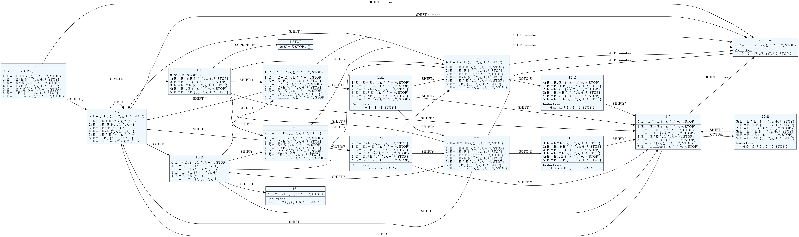
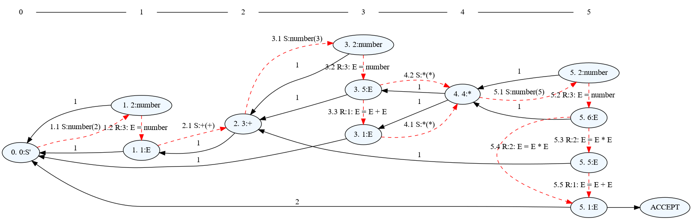

# The `pglr` command

`pglr` command is available after parglare is installed. This command is used to
debug the grammar, visualize the LR automata and make a visual trace of the GLR
parsing.

To get the help on the command run:

    $ pglr --help

    usage: pglr [-h] [-d] [-i] cmd grammar [input_file]

    parglare checker and visualizer

    positional arguments:
      cmd         Command - 'viz' or 'check' or 'trace'
      grammar     parglare grammar file
      input_file  input file for GLR trace subcommand.

    optional arguments:
      -h, --help  show this help message and exit
      -d          run in debug mode
      -i          input_file for trace is input string, not file.

## Checking the grammar

To check your grammar run:

    $ pglr check <grammar_file>

where `<grammar_file>` is the path to your grammar file.

If there is no error in the grammar you will get `Grammar OK.` message. In case
of error you will get error message with the information what is the error and
where it is in the grammar.

For example:

    $ pglr check calc.pg
    Error in the grammar file.
    Error in file "calc.pg" at position 4,16 => "/' E  left*, 2}\n | E ".
    Expected: { or | or ; or Name or RegExTerm or StrTerm

## Getting detailed information

To get the detailed information on the grammar run `pglr` command in the debug mode.

   $ pglr -d check calc.pg

    *** GRAMMAR ***
    Terminals:
    number STOP + - ^ EMPTY ) \d+(\.\d+)? ( EOF / *
    NonTerminals:
    S' E
    Productions:
    0: S' = E STOP
    1: E = E + E
    2: E = E - E
    3: E = E * E
    4: E = E / E
    5: E = E ^ E
    6: E = ( E )
    7: E = number

    *** STATES ***

    State 0
            0: S' = . E STOP   {}
            1: E = . E + E   {STOP, -, +, ^, ), /, *}
            2: E = . E - E   {STOP, -, +, ^, ), /, *}
            3: E = . E * E   {STOP, -, +, ^, ), /, *}
            4: E = . E / E   {STOP, -, +, ^, ), /, *}
            5: E = . E ^ E   {STOP, -, +, ^, ), /, *}
            6: E = . ( E )   {STOP, -, +, ^, ), /, *}
            7: E = . number   {STOP, -, +, ^, ), /, *}

        GOTO:
         E->1

        ACTIONS:
         (->SHIFT:2, number->SHIFT:3

    ...

This will give enumerated all the productions of your grammars and all the
states. For each state you get the LR items with lookahead, elements of GOTO
table and elements of ACTIONS table. In the previous example state 0 will have a
transition to state 1 when `E` is reduced, transition to state 2 if `(` can
be shifted and transition to state 3 if `number` can be shifted.

In addition you will get a detailed information on all Shift/Reduce and
Reduce/Reduce conflicts which makes much easier to see the exact cause of
ambiguity and to use [disambiguation rules](./conflicts.md#resolving-conflicts)
to resolve the conflicts or to go with GLR if the grammar is not LR(1).

!!! note
    You can use `-d` option with any `pglr` command to put the parser in the debug
    mode and get a detailed output.

## Visualizing LR automata

To visualize your automata with all the states and possible transitions run the
command:

    $ pglr viz calc.pg
    Grammar OK.
    Generating 'calc.pg.dot' file for the grammar PDA.
    Use dot viewer (e.g. xdot) or convert to pdf by running 'dot -Tpdf -O calc.pg.dot'

As given in the output you will get a `dot` file which represents LR automata
visualization. You can see this diagram using dot viewers or you can transform
it to other file formats using the `dot` tool (you have to install Graphviz
software for that).

This is an example of LR automata visualization for the `calc` grammar from the
quick intro (click on the image to enlarge):

!!! note

    If you are parsing non-textual input and you are
    using [custom recognizers](./recognizers.md) then the grammar will not be
    valid from the point of view of pglr command as the referenced custom
    recognizers are missing (they are supplied during `Grammar` instantiation). To
    visualize PDA automata in this case you can make a set of dummy recognizers in
    the grammar and comment them out during normal operation but remove the
    comment when running `pglr viz` command.

        /*  <--- commented out during normal operation. Remove block comment for
                 visualization
        my_recognizer1 = "dummy";
        my_recognizer2 = "dummy";
        */

## Tracing GLR parsing

GLR parser uses a graph-like stack (_Graph-Structured Stack - GSS_) and to
understand what's going on during GLR operation GLR parser and `pglr` command
provide a way to trace the GSS.

To run the GLR trace:

    $ pglr -i trace calc.pg "2 + 3 * 5"

The `-i` switch tells the command to treat the last parameter as the input
string to parse and not as a file name of the input.

!!! note
    Since the GSS can be quite large and complex for larger inputs the advice is
    to use a minimal input that will exibit the intended behaviour for a
    visualization to be usable.

The `trace` subcommand implies `-d` switch so the parser will run in debug mode
and produce the detailed output on the grammar, LR automata and the parsing
process.

Additionally, a `dot` file will be created, with the name `parglare_trace` if
input is given on command line or `<input_file_name>_trace.dot` if input is
given as a file. The `dot` file can be visualized using dot viewers or
transformed to other file formats using the `dot` tool.

For the command above, GLR trace visualization will be (click on the image to
enlarge):

Dotted red arrows represent each step in the parsing process. They are numbered
consecutively. After the ordinal number is the action (either S-Shift or
R-reduce). For shift action a grammar symbol and the shifted value is given. For
reduction a production is given and the resulting head will have a parent node
closer to the beginning.

Black solid arrows are the links to the parent node in the GSS.

There are also dotted orange arrows (not shown in this example) that shows dropped
empty reductions. Dropping happens when parser has found a better solution (i.e. a
solution with fewer empty reductions).

!!! note

    Putting the [GLR parser in debug mode](./debugging.md) from code (setting
    `debug` constructor parameter to `True`) will give the debug/trace output as
    well as generate the trace visualization.
